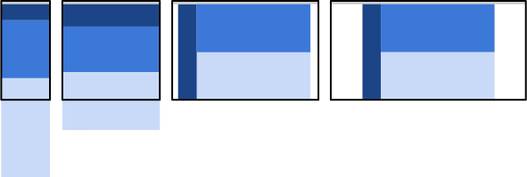

# 响应式开发
  - meta标签
  ```html
  <!-- 以下标签定义了该页面的宽度等于设备的宽度,并且缩放比例为1:1,用户不可缩放 -->
  <!-- 根据设备像素比设置初始化缩放倍数 -->
  <meta name="screen" content="width=device-width,initial-scale=1,maximum-scale=1,user-scalable=no">

  ```
    例如,iphone5的像素设备比为2,意思是css的一个像素等于iphone设备的两个像素;所以css像素要缩小一倍,那么缩放比就要设置成1/2

## 像素并非像素
  在移动端中,css的像素并不等于设备的像素,设备有像素缩放比,导致css的像素,与实际的设备物理像素不一样.在初始化缩放为1的情况下(让一个设备像素等于一个css像素),一个css像素才等于一个设备像素.

  - 设备独立像素
    这个跟分辨率有关 , 属于 也就是屏幕宽度

  - ppi/dpi 像素密集度
    由 实际分辨率(硬件方面)的平方相加再 开方 除以 尺寸(单位英寸如 5.5) 也就是 根号(x^2 + y^2)/屏幕英寸

  - 设备像素比 
    设备像素(分辨率) / 设备独立宽度 
  
  各个移动端浏览器会有不用的缩放比,所以页面显示不尽相同,设置initial-scale=1.0 时,css像素等于一个设备物理像素,缩放的其实就是css像素.

## viewport
  当不设置这个的时候 手机浏览器会把这个网页 整体缩小 然后在显示出来 ,如果你原本 50px 的盒子 在手机端 会变得很小 因为 手机(例如 iphone 5 ) 320 px的宽度 他显示的是 980个(layout viewport) css的 px 所以实际上 980/50 = 320/x 得到 
  的是16 px; 设置了 viewport initial-scale=1 的时候16 px 是等于 没设置的时候的 50 px; 其实viewport 就是设置如何缩放 css像素的 initial-scale=1 这个就代表 1css像素 就等于 1 屏幕的像素  不设置的时候 2.几个css 像素 px 等于 1 个 屏幕px

  layout viewport  一般比视口大 浏览器把 网页缩放到layout viewport 里面 显示 

  visual viewport 严格等于浏览器宽度 用来显示layout viewport 可控制与layout viewport 的z轴距离 来达到缩放与放大的效果  

### 设置viewport
  通常要设置width = 设备的宽度(device-width) 初始化缩放为1.0
  
  不设置width时,缩放度越小, html的宽度越大 layout viewport 缩放度 越大 这样html 的宽度会很小

  设置了width时 缩放度少于1 会放大html宽度 原本320px 的屏幕 需要640px 才可以铺满 若果width 大于1 将会放大 css px 单位 例如等于2 原本320px 的屏幕 160 的 css px 就可以铺满 
  ```html
  <meta name="viewport" content="width=device-width,initial-scale=1.0"></meta> 
  ```
  属性:
  - width：控制 viewport 的大小，可以指定的一个值，如 600，或者特殊的值，如 device-width 为设备的宽度（单位为缩放为 100% 时的 CSS 的像素）。
  - height：和 width 相对应，指定高度。
  - initial-scale：初始缩放比例，也即是当页面第一次 load 的时候缩放比例。
  - maximum-scale：允许用户缩放到的最大比例。
  - minimum-scale：允许用户缩放到的最小比例。
  - user-scalable：用户是否可以手动缩放。

## 媒体查询

  - min-width:600px

  最小600,也就是最小都要600才使用,大于600不用里面的样式

  - max-wdith:600px

  最大600,也就是600以内使用以上媒体查询的样式

## 响应式图片

  ```html
  <picture>
  <source media="print" srcset="landscape_print.jpg">

  <source media="(max-width: 480px)"
          srcset="landscape_small.jpg">

  <source media="(max-width: 640px)"
          srcset="landscape_medium.jpg">

  <source media="(max-width: 1024px)"
          srcset="landscape_large.jpg">

  
</picture>
  ```

## 响应式模式

  - 主体为流动(mostly fluid)

  小屏幕上(手机) 所有类容垂直堆叠,中屏幕(平板),主体内容宽度百分百,其他宽度百分50垂直堆叠,pc屏幕上设置固定宽度;

  

  - 栏内容下排(cloumn drop)

  宽度始终为百分百的多列布局

  

  - layout shifter (版面位移)

  变化较大,元素并不是自动的换行,需要手动设置媒体查询去更改布局,可能会影响到元素内部的布局,维护起来很困难

  
  
  - 利用屏幕外部的空间(off canvas)

  这种模式,那隐藏元素放在屏幕外部,当宽度足够时才会显示他们;

  


## em布局 
  em单位根据父元素的字体大小来换算,`子元素的字体大小使用em单位的时候,并不是以父元素的字体大小换算`
## rem布局
  rem单位根据根元素html的字体大小来换算,也就是说,只要动态的调整html的字体大小,即可以动态的调整整个页面整体大小


