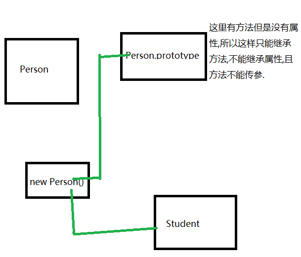
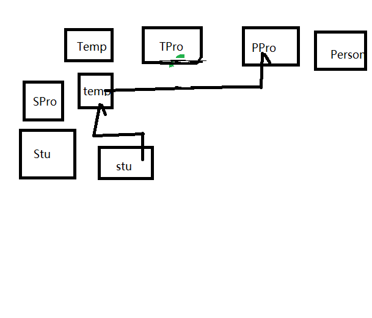

# 面向对象

## 原型对象

- 原型对象的属性和方法可以被所有的对象实例共享
- 实例的原型对象是构造函数的prototype,构造函数的prototype也有原型对象,向上一级构造函数的prototype属性.

```javascript
  Person.prototype;
```

所有的函数的prototype都有一个constructor属性指向自己

- 判断原型和实例的关系

```javascript
  obj.constructor === Object
  obj instanceof Object
  // isPrototypeOf():判断当前对象是否为实例的原型

  Object.prototype.isprototypeOf(obj);

```

## es5 对象扩展

- 属性特性(可以更深入的让我们操作对象的属性)(也称描述符,只能使用描述符的一种,不能同时使用两种)
- 值属性(数据描述符)
- writable:false/true  false为不可修改
- configurable:false/true false为不可配置
  - 若这个属性为flase,其他选项均不可修改,不然会报错
- value:''  修改值
- enumerable :false/ture false为不可枚举,forin循环不会遍历这个属性

- 访问器属性(存取描述符)
- configurable
- enumerable
- get  
- set

```javascript
//访问器属性用法,必须要依靠变量
let obj = {};
let name = 'kimpee';
Object.defineProperty(obj,'name',{
  get : function(){
    return name;
  },
  set : function(val){
    name = val;
  }
});
```

- 注意
- es5有3个操作会忽略掉enumerable 为false的属性,for...in,Object.keys(),JSON.stringify();

- 属性特性操作

- 设置
- Object.definePrototype(obj,key,descriptor);设置单个属性的特性

```javascript
  Object.defineProperty({name:'kimpee'},'name',{value:'Joey'});//返回修改后的对象
```

- Object.defineProperties(obj,descriptors);设置多个属性的特性

```javascript
  Object.defineProperties({name:'kimpee',age:18},{
    name:{
      value:'Joey'
      configurable:false;
    },
    age:{
      configurable:false
      value:19,
    }
});
```

- Object.getOwnPropertyDescriptor(obj,key);获取属性的特性

```javascript
  var let = Object.getOwnPropertyDescriptor(obj,'age');
```

- Object.keys(obj); 获取所有的key值

```javascript
  Object.keys({name:'kimpee',age:18});
```

- Object.getOwnPropertyNames(obj);与keys的区别是,它可以获取不可枚举的属性

```javascript
  let Object.getOwnPropertyNames({name:'kimpee',age:18})
```

- myObject.propertyIsEnumerable('a') 返回属性a是否是可枚举的

- Object.entries();返回可枚举属性的[key,value]数组, 迭代器

- Object.getOwnPropertySymbols(); 它返回包含了指定对象自身所有的符号属性

  *建议使用传统方式添加属性,利用Object.defineProperty()去修改属性特性*

## 对象操作

  in (操作符)和hasOwnProperty()，(此方法返回true or false ) 这两个的差别在于是否检索原型链.
  Object.keys(myObject) 和 Object.getPropertyNames() 区别在于是否能获取不可枚举的属性,前者不能,后者能.

## 继承

- 原型链继承
- 核心
  - 拿父类的实例充当子类的原型对象
- 缺点
  - 只能继承方法,不能继承属性.
  ```javascript
  function Person(name){
    this.name = name;
  }
  Person.prototype =  {
    say(){
      console.log(this.name);
    };
  }
  Object.defineProperty(Person.protopyte,'constructor',{
    configurable:true,
    value :Person,
    enumerable:false;
  });
  function Student(){

  }
  Student.prototype = new Person();
  ```

  

- 借用构造函数

借用父类的构造函数来增强子类的实例

```javascript
function Person(name){
  this.name = name;
}
Person.prototype = {
say(){
    console.log(this.name);
  }
};
Object.defineProperty(Person.protopyte,'constructor',{
  configurable:true,
  value :Person,
  enumerable:false;
});

function Student(name){
  //是用call或者apply 方法把Person的属性和Student联系起来
  Person.call(this,name);
}

Student.prototype = new Person();
Student.prototype.yes = function(){
  console.log('yes');
}
var stu = new Student('kimpee');

// 缺点
//new stu以后 因为stu的原型是 Person 实例 因为new Person()时并没有传递参数,因此,会产生多余参数.
```

- 组合继承

使用以上两种方法,达到完全继承.

- 原型式继承

创建一个函数

```js
function inherit(o){

  function Temp (){

  }
  Temp.prototype = o;
  return new Temp();
}
Student.prototype = inherit(Person.prototype);
//ES5ES5已封装好
Student.prototype = Object.create(Person.prototype);
let student = new Student();
// student 先指向temp实例再指向Person.prototype
```

    

- es5 寄生组合继承方法(完美继承方法);

组合增强函数和原型式继承

- es6 继承(引入class,extends,super(),static)关键字

```javascript
class Person {
  let static
  constructor(name,age,){

  }
}

class Student extends Person{
  constructor(name){
    super(name,18);
  }
}
```
