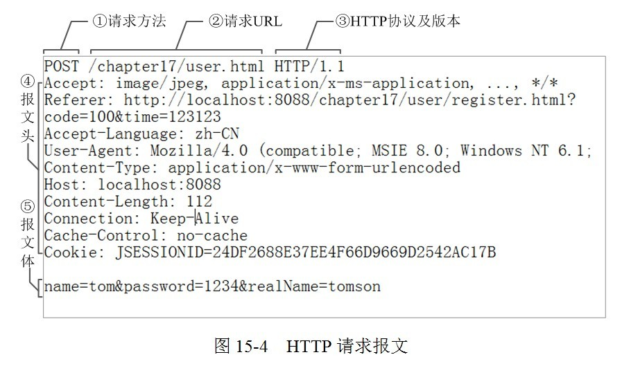
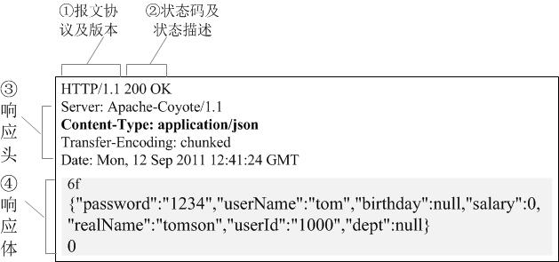

# http报文,请求行,请求体,请求头;
  

## 请求头(值为键值对的形式存储,服务器根据这个获取客户端的信息)
  - Accept,相当于告诉服务端接受什么类型的相应;值可为一个或多个MIME类型
        Accept:text/plain
  - Cookie,发送Cookie到服务端`Cookie`中有一个jsession属性用于判断是否同一个session
  - Refer,存放url
  - Accept-Language
  - Catch-Control:no-catch 缓存控制,no-catch代表不缓存
  - Content-Type:application/x-www-form-urlencoeded
## 请求体(参数,以键值对的形式存储)

## 响应报文
  
  - 响应体就是我们要的数据
  - Content-Type:application/json
